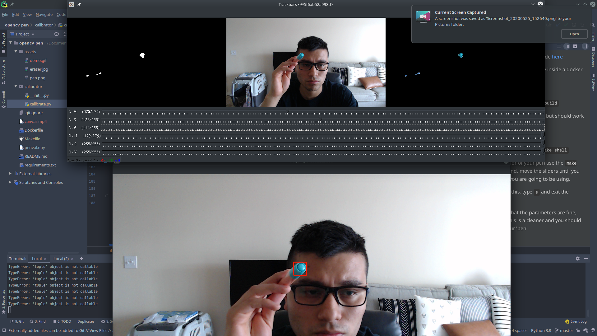

Inspired by [this](https://www.learnopencv.com/creating-a-virtual-pen-and-eraser-with-opencv/)
post, from the code [here](https://github.com/spmallick/learnopencv/tree/master/Creating-a-Virtual-Pen-and-Eraser)

I wanted to be able to use opencv inside a docker container 

Running: 

Have docker installed 
now `make build`

This was only tested on Kubuntu, but should work on other OS's 
`sudo xhost +`

and run it with a `make run`

2 windows will appear, tweak the sliders until you only see your 'pen'

Hit the `s` key, this will safe the numpy array, the next window will read from this file 

If you want to debug, just do a `make shell` 
